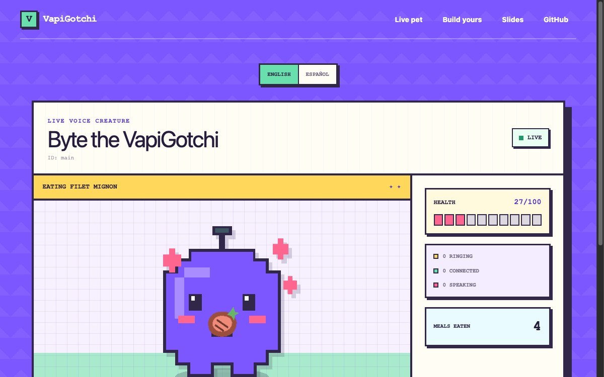

# VapiGotchi

> 🧪 **This is a showcase demo, not an officially supported Vapi product.**
> It was built for The Next Craft hackathon workshop to inspire builders and
> is not production ready.

A live pixel creature powered by a [Vapi](https://vapi.ai) voice assistant.
Call it, talk to it, and ask it to eat, dance salsa, shower, or nap.
VapiGotchi turns realtime call events and API tool calls into visible
animations for a room full of builders.

**[Open the live VapiGotchi](https://vapigotchi.vapi-0461.chatgpt.site)** ·
**[Present the workshop](https://vapigotchi.vapi-0461.chatgpt.site/slides)** ·
**[Connect your assistant](https://vapigotchi.vapi-0461.chatgpt.site/setup)**



## What builders learn

- how a Vapi assistant, model, voice, and transcriber work together;
- how server events connect a voice call to a product UI;
- how an assistant calls an HTTP API tool to read and change state; and
- how to give every workshop participant an isolated experience with one ID.

The assistant ID is the pet ID. Opening `/pets/<assistant-id>` creates that
assistant's isolated creature. The first Vapi server event also renames the
creature to the assistant's name, once.

## Presentation deck

Open `/slides` to present the workshop from the same browser tab as the live
demo. The ten-slide deck covers Vapi, assistants, tools, Composer, server
events, the VapiGotchi build, workshop steps, remix ideas, and resources.

Switch the entire deck between English and Spanish. Use the on-screen controls,
the left/right arrow keys, Page Up/Page Down, Home/End, or the presentation
button for fullscreen mode.

## Try it locally

Requirements: Node.js 22.13 or newer.

```bash
git clone https://github.com/VapiAI/vapi-labs.git
cd vapi-labs/projects/vapigotchi
npm install
npm run dev
```

Open [http://localhost:3000/setup](http://localhost:3000/setup), paste a Vapi
Assistant ID, and follow the generated instructions. Local development uses a
local Cloudflare D1 database automatically.

Run every check with:

```bash
npm run check
```

## Connect a Vapi assistant

1. Create an assistant in the Vapi dashboard and copy its Assistant ID.
2. Open `/setup` and choose an isolated or shared pet. Paste the ID for an
   isolated pet, then set the generated Server URL. Vapi's default server
   messages already include `status-update` and `speech-update`.
3. Add the generated `check_vapigotchi` and `feed_vapigotchi` API Request
   tools to the assistant. The setup page provides a ready-to-paste Composer
   prompt as the primary path and exact JSON as a manual fallback.
4. Keep the generated pet page open and start a test call from Vapi.

The setup page has an English/Spanish toggle. It translates the workshop
instructions, starter assistant prompt, first message, and the descriptions
inside the tool JSON definitions while keeping API field and function names
unchanged. The required path stays focused on two tools; a collapsed optional
section provides the extra care tool, prompt addendum, and Composer prompt.

The home page has the same language toggle. English shows Byte, the public
English phone number, and `/pets/main`. Spanish shows Chorizo, the public
Spanish phone number, and `/pets/chorizo`. The copy button always copies the
live URL for the currently selected creature.

Choose **My isolated pet** for one creature per assistant. Choose the **shared
demo** option to point every team's Server URL and tools at the featured pet
for the selected language: `/pets/main` for English or `/pets/chorizo` for Spanish.
Calls, meals, and optional care actions then appear on that language's shared
creature and counter. Workshop team calls still start from each team's Vapi
dashboard.

VapiGotchi acknowledges unused valid JSON server messages with `200`. It uses
`status-update` and `speech-update` for the visualization and safely ignores the
other default message types without touching pet state.

Use a prompt like:

> You are the creature shown on the VapiGotchi page. Check your state when the
> caller asks how you feel. When they ask you to eat, call `feed_vapigotchi`
> with one available food, then react with delight. Never claim you ate unless
> the tool succeeded.

The optional bonus adds one more API Request tool:

- `care_for_vapigotchi`, a POST request whose `action` is `dance-salsa`,
  `shower`, or `nap`.

Open the bonus section on `/setup` only after the two core tools work. It
contains a separate Composer prompt, exact tool JSON, and a system prompt
addendum, so the main workshop remains lightweight.

See [the workshop guide](docs/WORKSHOP.md) for the facilitator agenda and
[the architecture guide](docs/ARCHITECTURE.md) for the event and state model.

## Canonical demo configuration

The web page is a live visualizer, not a call client. Start workshop calls with
the **Test** button in the Vapi dashboard. The dashboard call still sends all
configured server events and API Request tool calls to this app.

The canonical demo uses two single-language assistants. Byte speaks only
English at `+1 (659) 399-0187`. Chorizo speaks only Spanish at
`+1 (984) 305-5885`. Both assistants have the optional care tool enabled, use
silent `request-start` tool messages, and forbid spoken filler before a tool
call.

As an optional bonus, an assistant-specific pet page can also start a call with
the Vapi Web SDK. Expand the optional call panel and paste a Vapi public key.
The key stays in browser memory for that tab and is never sent to VapiGotchi.

The only optional runtime secret is `ADMIN_API_KEY`, used to reset workshop
state. VapiGotchi does not need a Vapi API key at runtime.

## API

| Method | Route | Purpose |
| --- | --- | --- |
| `GET` | `/api/v1/pets/:petId` | Read pet state |
| `GET` | `/api/v1/pets/:petId/live` | Read pet, calls, and new events |
| `POST` | `/api/v1/pets/:petId/feed` | Feed the pet |
| `POST` | `/api/v1/pets/:petId/care` | Dance salsa, shower, or nap |
| `POST` | `/api/v1/pets/:petId/vapi/events` | Receive Vapi server events |
| `POST` | `/api/v1/admin/pets/:petId/reset` | Reset a pet with the admin key |
| `GET` | `/api/health` | Deployment health check |

Feed request:

```json
{
  "food": "pupusa"
}
```

Available foods are `apple`, `pizza`, `burger`, `sushi`, `bagel`,
`protein-shake`, `sandwich`, `empanada`, `ramen`, `soup`, `burrito`,
`filet-mignon`, `chicken`, `cheese`, `tomato`, `taco`, `arepa`, `pupusa`, and
`ceviche`. A meal adds 15 health up to 100. Health lazily decays by one point
every two minutes.

Optional care request:

```json
{
  "action": "dance-salsa"
}
```

Salsa adds 5 health, a shower adds 10, and a nap adds 20, each capped at 100.

## Privacy and workshop safety

VapiGotchi stores call IDs, coarse call status, the current speaker role, and
pet action events. It does **not** store transcripts, caller names, or phone
numbers. Stale calls automatically disappear from the live counter.

The public feed endpoint is intentional for the workshop. Use a separate
deployment or add authentication and rate limiting before adapting this
project for sensitive or production data.

## Known limitations

- Pet updates use adaptive polling rather than a persistent realtime connection.
- Public workshop endpoints intentionally have no per-participant authentication
  or rate limiting.
- The hosted demo is shared infrastructure and should not receive sensitive data.
- The optional in-page call launcher requires each builder's own Vapi public key.

## Stack

- Next.js-compatible app router through [vinext](https://github.com/cloudflare/vinext)
- Cloudflare Workers and D1
- React
- Optional Vapi Web SDK call launcher on assistant-specific pet pages
- Adaptive HTTP polling: 450 ms during calls, 2 seconds while idle, and 8
  seconds in a hidden tab

## License

MIT

## Built by

[Margarita](https://github.com/margarita-vapi) for Vapi DevRel.
