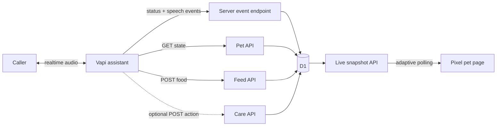

# Architecture

VapiGotchi is deliberately small: one Vapi assistant ID maps to one D1-backed
pet namespace, and the browser reads a compact live snapshot over adaptive
polling.

## Namespace model

The route `/pets/:petId` accepts an Assistant ID as `petId`. There is no
separate pet registration flow. D1 creates the row lazily on the first page,
webhook, or tool request.

The first request that contains `message.assistant.name` changes `VapiGotchi`
to that assistant name and marks the pet personalized. Later requests cannot
rename it, which keeps the public page stable.

The canonical workshop demo has two reserved namespaces, even though both
assistants have UUIDs. Byte uses `main` for English, and Chorizo uses `chorizo`
for Spanish. Each assistant's Server URL and API tools point to its matching
namespace.

## State model

| Table | Stores | Does not store |
| --- | --- | --- |
| `pets` | ID, display name, health, meal count, timestamps | user identity |
| `pet_calls` | Vapi call ID, status, active speaker role | transcript, phone number, caller name |
| `pet_events` | food or care action, health gain, post-action health, optional call ID | tool prompt or conversation content |

Health begins at 35, gains 15 per meal, and is capped at 100. The optional care
actions add 5 for salsa, 10 for a shower, and 20 for a nap. Decay is lazy:
reads calculate one lost point per two elapsed minutes without background jobs.
The next state-changing action persists the decayed value before applying its
gain.

## Live state

The page calls `/api/v1/pets/:petId/live` with an event cursor. A response
contains the current pet, aggregate call counts, and only pet action events
newer than the cursor.

Polling adapts to user-visible activity:

- 450 ms while one or more calls are ringing or connected;
- 2 seconds while idle; and
- 8 seconds when the tab is hidden.

This is intentionally easier to teach and deploy than a WebSocket layer. A
stale call is marked ended after ten minutes so interrupted webhooks do not
leave the counter stuck forever.

## Visual state priority

Only one primary animation is shown at a time:

1. eating or care action event;
2. assistant speaking;
3. user speaking;
4. connected call;
5. ringing call; and
6. health-derived mood.

Concurrent calls remain visible in the counter even when one higher-priority
animation owns the creature.

## Endpoint behavior

The Vapi server event endpoint handles `status-update` and `speech-update`.
Unknown message types are acknowledged but ignored, which keeps it safe to use
as an assistant-level Server URL alongside additional enabled Vapi messages.

The feed API accepts one `food` value from the fixed enum. A `lemon` event uses
the standard meal health gain and adds a lemon-only sour expression to the
normal eating animation. The optional care API accepts `dance-salsa`, `shower`,
or `nap`. D1 batches each health update and event insert so pollers receive an
ordered animation cursor.
